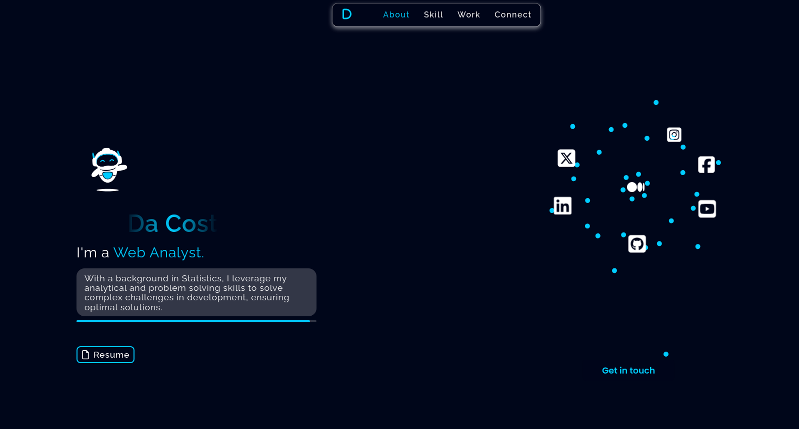
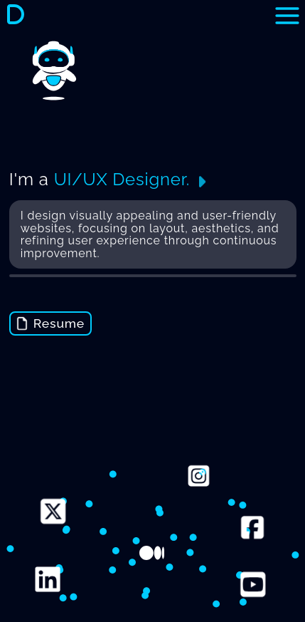

<div align='center'>

# [Ace](https://github.com/asdacosta)'s Portfolio

</div>
<div align='center'>
    <h3>💻 Technologies</h3>
    
    
    
    
    
    
    
    
    
    
    
    
    
    
    <h4><a href="https://bit.ly/aceDaCosta">Live Preview</a></h4>
</div>

**Demo:**


<details>

**<summary>Screen views</summary>**

**Desktop View:**


<br>

**Mobile View:**



</details>

## 🌐 Origin

Personal

## 📝 Description

Builds [Ace](https://github.com/asdacosta)'s main portfolio.

<details>
<summary>Special Features</summary>

- Real-time feedback from fields in Connect section.
- Highlight current section in viewport.
- Reveal parts of work samples on scroll or drag.

</details>

## 🎯 Relevance

To showcase general prowess in development and works.

## 👥 Intended Audience

Developers, users, and non-developers.

> [!NOTE]
> Users can install all dependencies using `package.json` file via:
>
> ```bash
> npm install
> ```

## 📂 Files

<details>
<summary>Invert</summary>

| File                      | Description                                                                                                           |
| ------------------------- | --------------------------------------------------------------------------------------------------------------------- |
| `src/*`                   | Source files that are bundled into the output directory `dist/`.                                                      |
| `src/main.jsx`            | The main JavaScript entry point that bundling begins.                                                                 |
| `src/App.jsx`             | Main component where overall structure and other layout components of the app are contained.                          |
| `src/assets/*`            | All assets(images, icons, vids) used in website.                                                                      |
| `src/components/Cart.jsx` | Displays Cart.                                                                                                        |
| `src/components/About/`   | Components and stylesheet for About section at top of page.                                                           |
| `src/components/Connect/` | Components and stylesheet for Connect section at bottom of page. wrong.                                               |
| `src/components/Load/`    | Component and stylesheet for Load displayed at page load.                                                             |
| `src/components/Nav/`     | Components and stylesheet for Nav section of page. wrong.                                                             |
| `src/components/Skill/`   | Components and stylesheet for Skill section on page. wrong.                                                           |
| `src/components/Work/`    | Components and stylesheet for Work section on page. wrong.                                                            |
| `src/sreset.css`          | Resets style to default for consistency across different devices and browsers..                                       |
| `src/App.css`             | General stylesheet for `App.jsx`                                                                                      |
| `dist/*`                  | Output files from bundling of files in directory `src/`.                                                              |
| `dist/main.js`            | Main JavaScript output file that contains the bundled JavaScript code. Code is minified and optimized for deployment. |
| `package*`                | Contains details of project and dependencies versions.                                                                |
| `readme-assets/*`         | Live demo and different screen views used in `README.md`.                                                             |

</details>

## ©️ Credit

<details>
<summary>Invert</summary>

| File                  | Description             |
| --------------------- | ----------------------- |
| `src/assets/*.lottie` | Lottie animation files. |
| `src/assets/works/*`  | Screenshots of works.   |

</details>

## 🔄 Improvements

<details>
<summary>Invert</summary>

- [ ] Let Bot populate any free places.
- [ ] Add loading bar.
- [ ] Work on performance.
- [ ] Light mode and few custom colors.
- [ ] Fine tune the min-max translate in intervals of 5 / Remove.
- [ ] Add map to contact section.
- [ ] Add French translation.
- [ ] Add Subscribe to NewsLetter option in Motive in Connect's fields.
- [ ] Set display of work samples stars to normal and fix logic to work.
- [ ] Make country list drop down smoothly.
- [ ] Refactor.
- [ ] Make technologies' name have the background color of the icon
- [ ] Instead of default immediate shift during resizing, style page in such a way that resizing animates.
- [ ] Replace facebook icon with Dev.to icon in `AboutSocials.jsx`.
- [ ] Use typed.js for all typing effects (feedbacks in Fields) to enable bold and longer pause effect without inconsistencies.
- [ ] Fix chevron cover in motive field that drops when input is checked so that it always stays in position.
- [ ] Set display of Blog in `Nav.jsx` to normal and add blogs.
- [ ] Add sound.
- [ ] Animate image title replacement according to slide direction.
- [ ] Make scroll appear in Safari browser.
- [ ] Update naming.
- [ ] Make work samples in `Work.jsx` have a solitary component.
- [ ] Make responsive on screens with higher resolution.

</details>

## 👤 Curator

1. [Ace Da Costa Silvanus](https://github.com/asdacosta)

**[🞁 Top](#aces-portfolio)**
